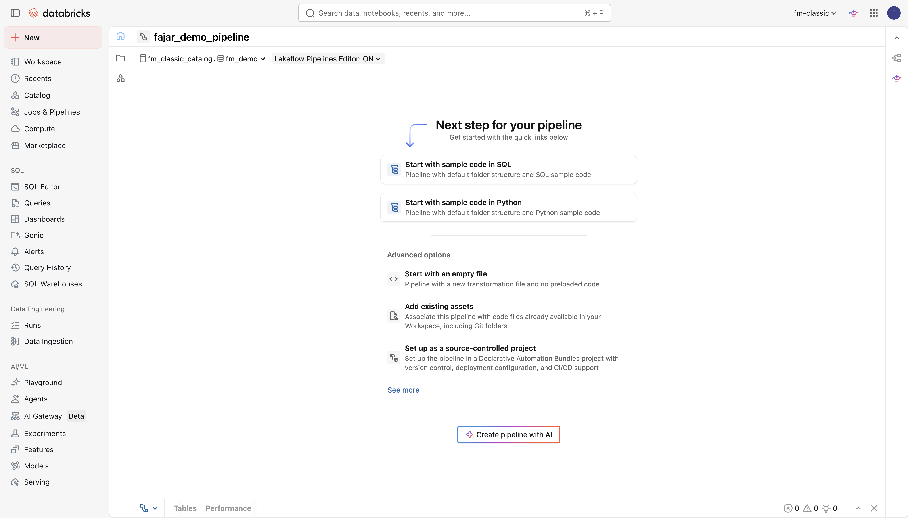

# Tutorial FSI Simple (Bahasa Indonesia)

Tutorial ini adalah versi sederhana dari tutorial FSI (Financial Services Industry). Anda akan membangun pipeline data **Perbankan Ritel** secara end-to-end menggunakan **Databricks Workspace UI** dan **Genie Code**, dengan **prompt yang ringkas dan konversasional** dalam Bahasa Indonesia.

Semua data pada tutorial ini berasal dari satu bank fiktif — **Bank Nusantara Sejahtera** — dengan jaringan cabang di seluruh Indonesia.

Fokus tutorial: data **cabang bank**, **rekening nasabah**, dan **transaksi perbankan** dari nasabah di berbagai cabang di Indonesia.

> **Sebelum mulai:** Pastikan Anda telah menyelesaikan semua langkah pada bagian [Prerequisites](README.md#1-prerequisites) di README utama dan telah men-download file CSV FSI Biz ke komputer lokal Anda.

> **Penting:** Sepanjang tutorial ini, ganti `<your_username>` dengan username Anda yang sebenarnya (mis. `user01`). Ganti `<your_catalog>` dengan nama catalog yang ditugaskan kepada Anda di workspace.

---

## Exercise 1: Buat Schema Anda

*Tool: Workspace UI*

Pada exercise ini, Anda akan membuat schema untuk menampung semua tabel di pipeline FSI Anda.

### Langkah-langkah

1. Pada sidebar kiri, klik **Catalog**
2. Telusuri catalog explorer untuk menemukan catalog Anda (`<your_catalog>`)
   - Jika Anda perlu membuat catalog sendiri: klik tombol **+** di bagian atas catalog explorer, pilih **Create catalog**, beri nama `<your_username>_catalog`, lalu klik **Create**
3. Klik catalog Anda untuk meng-expand
4. Klik tombol **+** di sebelah nama catalog (atau menu kebab **...** > **Create schema**)
5. Masukkan nama schema: `<your_username>_demo`
6. Klik **Create**

### Validasi

- Di catalog explorer, expand catalog Anda
- Pastikan `<your_username>_demo` muncul di bawah catalog

---

## Exercise 2: Buat Volume Landing

*Tool: Workspace UI*

Buat Unity Catalog Volume untuk menyimpan file CSV mentah yang akan Anda upload.

### Langkah-langkah

1. Di catalog explorer, navigasi ke `<your_catalog>` > `<your_username>_demo`
2. Klik nama schema untuk membukanya
3. Klik tombol **Create**, lalu pilih **Volume**
4. Set nama volume menjadi `landing`
5. Biarkan tipe volume sebagai **Managed**
6. Klik **Create**

### Validasi

- Di catalog explorer, navigasi ke `<your_catalog>` > `<your_username>_demo`
- Klik tab **Volumes**
- Pastikan volume `landing` muncul

---

## Exercise 3: Upload Data ke Volume

*Tool: Workspace UI (Drag & Drop)*

Upload data sampel FSI Biz ke landing volume dengan drag & drop folder secara langsung.

### Langkah-langkah

1. Di komputer lokal Anda, buka direktori `data/fsi_biz/` dari repository yang sudah Anda download. Anda akan melihat **3 folder** berikut:
   - `banking_branches/` — master data cabang bank
   - `banking_accounts/` — rekening nasabah (tabungan, giro, deposito, pinjaman)
   - `banking_transactions/` — transaksi perbankan (setoran, tarik tunai, transfer, pembayaran)
2. Di workspace Databricks, navigasi ke catalog explorer: `<your_catalog>` > `<your_username>_demo` > **Volumes** > `landing`
3. Klik volume `landing` untuk membukanya
4. Pilih **ketiga folder** dari direktori lokal `data/fsi_biz/` Anda dan **drag & drop** ke landing volume browser

Selesai — workspace akan meng-upload semua folder beserta file CSV-nya sekaligus.

### Validasi

- Telusuri volume `landing` di catalog explorer
- Pastikan ketiga subdirektori ada, masing-masing berisi file CSV-nya
- Klik salah satu file CSV untuk preview data

---

## Exercise 4: Buat Pipeline dan Bronze Layer

*Tool: Workspace UI + Genie Code di Pipeline IDE*

Sekarang kita akan membuat **Spark Declarative Pipeline** menggunakan workspace UI, lalu memakai Genie Code di dalam pipeline IDE untuk menulis bronze layer — ingest data mentah dari landing volume ke dalam streaming tables.

### Step 1: Buat Pipeline

1. Pada sidebar kiri, klik **New** > **ETL pipeline**
2. Konfigurasi pipeline:
   - **Pipeline name:** `<your_username>_fsi_ingestion`
   - **Default catalog:** `<your_catalog>`
   - **Default schema:** `<your_username>_demo`
3. Klik **Create pipeline with AI**



**Genie Code** akan terbuka untuk Anda masukkan prompt.

### Step 2: Tulis Bronze Layer dengan Genie Code

1. Pastikan **Genie Code** sudah terbuka dari sidebar (klik ikon sparkle di toolbar atau tekan `Cmd+I` / `Ctrl+I`)
2. Paste prompt berikut:

> **Genie Code Prompt:**
>
> ```
> tolong create script loading SQL menggunakan spark declarative pipeline
> untuk load file-file CSV yang ada di
> /Volumes/<your_catalog>/<your_username>_demo/landing
>
> setiap direktori akan di-load ke dalam satu streaming table
> ```

3. Tinjau kode SQL yang dihasilkan
4. Accept kode tersebut ke dalam source file Anda

### Validasi

- Tinjau source file — Anda harusnya melihat 3 definisi streaming table (satu per direktori CSV)
- Masing-masing harus menggunakan Auto Loader (`cloud_files`) dengan path volume yang benar
- Sidebar DAG pipeline harus menampilkan 3 tabel bronze

---

## Exercise 5: Tambahkan Gold Layer

*Tool: Genie Code di Pipeline IDE*

Pada tutorial ini kita **lompati silver layer** dan langsung membangun gold layer di atas bronze — agregasi level bisnis sebagai materialized views.

### Langkah-langkah

1. Pada pipeline IDE, klik **Add source file** (atau tombol **+**) untuk membuat file SQL baru
2. Beri nama file `03_gold.sql`
3. Buka Genie Code dan paste prompt berikut:

> **Genie Code Prompt:**
>
> ```
> tolong bikin 03_gold.sql dengan spark declarative pipeline.
> Saya mau bikin materialized view untuk gold layer.
> Saya mau analisis:
> - ringkasan transaksi dan saldo per cabang
> - trend transaksi bulanan per tipe transaksi
> - performa cabang (jumlah rekening, total saldo, volume transaksi)
> ```

4. Tinjau kode SQL yang dihasilkan — pastikan join dan agregasi masuk akal
5. Accept kode tersebut ke dalam source file Anda

### Validasi

- Tinjau `03_gold.sql` — Anda harusnya melihat 3 materialized view (satu per analisis)
- Masing-masing menggunakan `CREATE OR REFRESH MATERIALIZED VIEW`
- Sidebar DAG pipeline harus menampilkan lineage lengkap: bronze → gold

---

## Exercise 6: Jalankan Pipeline

*Tool: Workspace UI*

Pipeline Anda sudah memiliki kedua source file (bronze dan `03_gold.sql`). Saatnya menjalankannya.

### Langkah-langkah

1. Pada pipeline IDE, klik **Start** untuk menjalankan pipeline
2. Jika Anda sudah navigasi keluar, masuk ke **Pipelines** di sidebar kiri (di bawah **Data Engineering**), cari `<your_username>_fsi_ingestion`, lalu klik **Start**

### Monitor

- Perhatikan visualisasi DAG saat data mengalir dari bronze ke gold
- Pipeline akan menampilkan setiap streaming table dan materialized view sebagai node
- Node hijau = sukses, merah = gagal

**Jika pipeline gagal**, klik node yang gagal untuk melihat detail error. Gunakan Genie Code di pipeline IDE untuk troubleshoot — paste error message dan minta perbaikan.

### Validasi

1. Masuk ke **Catalog** > `<your_catalog>` > `<your_username>_demo`
2. Pastikan tabel bronze dan tabel gold (materialized view) sudah muncul
3. Klik beberapa tabel dan preview datanya untuk memastikan data ter-load dengan benar

---

## Exercise 7: Buat Genie Space

*Tool: Workspace UI*

Buat data gold layer dapat diakses oleh pengguna bisnis melalui **Genie Space** — antarmuka query bahasa alami. Pada tutorial ini kita hanya membuat **satu Genie Space**.

### Genie Space — Analitik FSI Perbankan

1. Pada sidebar kiri, klik **Genie**
2. Klik **New Genie space**
3. Pilih ketiga tabel gold (materialized view) dari `<your_catalog>.<your_username>_demo`:
   - Tabel ringkasan transaksi dan saldo per cabang
   - Tabel trend transaksi bulanan per tipe transaksi
   - Tabel performa cabang
4. Setelah space terbuka, klik **Configure** → **Edit** untuk memperbarui:
   - **Name:** `<your_username> - Analitik FSI Perbankan`
   - **Description:**
     > Genie Space ini menjawab pertanyaan bisnis seputar perbankan ritel Bank Nusantara
     > Sejahtera di Indonesia, mencakup ringkasan transaksi dan saldo per cabang, trend
     > transaksi bulanan per tipe transaksi, dan performa cabang.
5. Klik **Save**

### Uji Genie Space Anda

Coba ajukan pertanyaan dalam bahasa alami:

- "Cabang mana yang memiliki total nilai transaksi tertinggi?"
- "Tampilkan trend jumlah transaksi bulanan untuk transaksi transfer"
- "Channel apa yang paling sering digunakan nasabah?"
- "Berapa rata-rata saldo rekening per tipe rekening?"
- "Cabang mana yang memiliki jumlah rekening terbanyak?"

### Validasi

- Genie Space muncul di bagian **Genie** pada sidebar
- Space dapat menjawab pertanyaan terhadap ketiga tabel gold
- SQL warehouse memproses query dengan sukses

---

## Exercise 8: Buat Dashboard

*Tool: Workspace UI + Genie Code*

Buat dashboard untuk memvisualisasikan insight dari data gold layer menggunakan satu prompt singkat ke Genie.

### Step 1: Buat Dashboard

1. Pada sidebar kiri, klik **Dashboards**
2. Klik **Create dashboard**
3. Beri nama: `<your_username> - Dashboard FSI`

### Step 2: Generate Dashboard dengan Genie Prompt

Pada canvas dashboard, buka **Genie prompt** (asisten AI di dalam canvas dashboard) dan paste prompt berikut:

> **Genie Prompt:**
>
> ```
> tolong buat dashboard dari table-table gold yang ada di schema
> <your_username>_demo
> ```

Genie akan membuat dataset internal dan visualisasi secara otomatis berdasarkan tabel-tabel gold (materialized view) yang ada di schema Anda. Atur tata letak visualisasi di canvas dengan cara drag dan resize sesuai kebutuhan.

### Step 3: Publish

1. Klik **Publish** di pojok kanan atas editor dashboard
2. Dashboard sekarang dapat diakses oleh pengguna lain di workspace

### Validasi

1. Pada **Dashboards**, cari dashboard yang sudah Anda publish
2. Buka dan pastikan visualisasi sudah ter-render dengan data dari gold layer
3. Coba interaksi dengan filter atau klik elemen chart untuk eksplorasi

---

## Penutup

Selamat! Anda telah menyelesaikan tutorial **FSI Simple**! Berikut yang sudah Anda bangun:

| Step | Apa yang Anda Bangun | Tool |
|------|----------------------|------|
| Exercise 1 | Unity Catalog schema untuk demo Anda | Workspace UI |
| Exercise 2 | Managed volume untuk landing data mentah | Workspace UI |
| Exercise 3 | Upload data FSI Biz via drag & drop | Workspace UI |
| Exercise 4 | Pipeline + bronze layer dengan Auto Loader (1 prompt) | Workspace UI + Genie Code |
| Exercise 5 | Gold layer — materialized views agregasi bisnis (1 prompt) | Genie Code di Pipeline IDE |
| Exercise 6 | Menjalankan end-to-end Spark Declarative Pipeline | Workspace UI |
| Exercise 7 | Genie Space untuk analitik bahasa alami | Workspace UI |
| Exercise 8 | Dashboard otomatis dari gold layer (1 prompt) | UI + Genie Code |

**Apa Selanjutnya?**
- Coba modifikasi prompt agar Genie menghasilkan analisis yang lebih spesifik
- Ajukan pertanyaan-pertanyaan baru di Genie Space Anda dan amati bagaimana AI menafsirkannya
- Coba [tutorial FSI lengkap](TUTORIAL_FSI.md) untuk versi dengan bronze-silver-gold lengkap dan cakupan data perbankan & asuransi yang lebih luas
