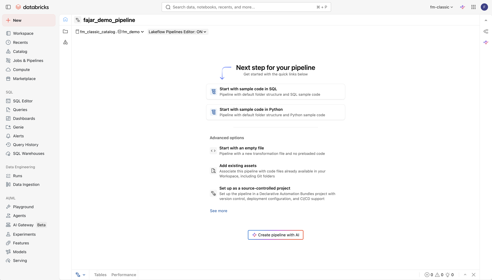

# Tutorial Pharma Retail Sales & Distribution (Bahasa Indonesia)

Tutorial ini akan memandu Anda membangun pipeline data **Penjualan & Distribusi Farmasi Ritel** secara lengkap menggunakan **Databricks Workspace UI** dan **Genie Code**.

Fokus tutorial: data **outlet apotek**, **transaksi penjualan**, dan **pengiriman distribusi** dari distributor ke outlet di Indonesia.

> **Sebelum mulai:** Pastikan Anda telah menyelesaikan semua langkah pada bagian [Prerequisites](README.md#1-prerequisites) di README utama dan telah men-download file CSV Pharma Biz ke komputer lokal Anda.

> **Penting:** Sepanjang tutorial ini, ganti `<your_username>` dengan username Anda yang sebenarnya (mis. `user01`). Ganti `<your_catalog>` dengan nama catalog yang ditugaskan kepada Anda di workspace.

---

## Exercise 1: Buat Schema Anda

*Tool: Workspace UI*

Pada exercise ini, Anda akan membuat schema untuk menampung semua tabel di pipeline Pharma Biz Anda.

### Langkah-langkah

1. Pada sidebar kiri, klik **Catalog**
2. Telusuri catalog explorer untuk menemukan catalog Anda (`<your_catalog>`)
   - Jika Anda perlu membuat catalog sendiri: klik tombol **+** di bagian atas catalog explorer, pilih **Create catalog**, beri nama `<your_username>_catalog`, lalu klik **Create**
3. Klik catalog Anda untuk meng-expand
4. Klik tombol **+** di sebelah nama catalog (atau menu kebab **...** > **Create schema**)
5. Masukkan nama schema: `<your_username>_pharma_biz`
6. Klik **Create**

<!-- Screenshot: Catalog explorer menampilkan schema baru -->

### Validasi

- Di catalog explorer, expand catalog Anda
- Pastikan `<your_username>_pharma_biz` muncul di bawah catalog

---

## Exercise 2: Buat Volume Landing

*Tool: Workspace UI*

Buat Unity Catalog Volume untuk menyimpan file CSV mentah yang akan Anda upload.

### Langkah-langkah

1. Di catalog explorer, navigasi ke `<your_catalog>` > `<your_username>_pharma_biz`
2. Klik nama schema untuk membukanya
3. Klik tombol **Create**, lalu pilih **Volume**
4. Set nama volume menjadi `landing`
5. Biarkan tipe volume sebagai **Managed**
6. Klik **Create**

<!-- Screenshot: Dialog pembuatan volume -->

### Validasi

- Di catalog explorer, navigasi ke `<your_catalog>` > `<your_username>_pharma_biz`
- Klik tab **Volumes**
- Pastikan volume `landing` muncul

---

## Exercise 3: Upload Data ke Volume

*Tool: Workspace UI (Drag & Drop)*

Upload data sampel Pharma Biz ke landing volume dengan drag & drop folder secara langsung.

### Langkah-langkah

1. Di komputer lokal Anda, buka direktori `data/pharma_biz/` dari repository yang sudah Anda download. Anda akan melihat **3 folder** berikut:
   - `retail_outlets/` — master data outlet (apotek, klinik, rumah sakit)
   - `retail_sales/` — transaksi penjualan ritel
   - `distribution_shipments/` — pengiriman dari distributor ke outlet
2. Di workspace Databricks, navigasi ke catalog explorer: `<your_catalog>` > `<your_username>_pharma_biz` > **Volumes** > `landing`
3. Klik volume `landing` untuk membukanya
4. Pilih **ketiga folder** dari direktori lokal `data/pharma_biz/` Anda dan **drag & drop** ke landing volume browser

Selesai — workspace akan meng-upload semua folder beserta file CSV-nya sekaligus.

<!-- Screenshot: Drag & drop folder ke landing volume -->

### Validasi

- Telusuri volume `landing` di catalog explorer
- Pastikan ketiga subdirektori ada, masing-masing berisi file CSV-nya
- Klik salah satu file CSV untuk preview data

---

## Exercise 4: Buat Pipeline dan Bronze Layer

*Tool: Workspace UI + Genie Code di Pipeline IDE*

Sekarang kita akan membuat **Spark Declarative Pipeline** menggunakan workspace UI, lalu memakai Genie Code di dalam pipeline IDE untuk menulis bronze layer — ingest data mentah dari landing volume ke dalam streaming tables.

### Step 1: Buat Pipeline

1. Pada sidebar kiri, klik **New** > **ETL pipeline**
2. Konfigurasi pipeline:
   - **Pipeline name:** `<your_username>_pharma_biz_ingestion`
   - **Default catalog:** `<your_catalog>`
   - **Default schema:** `<your_username>_pharma_biz`
3. Klik **Create pipeline with AI**



**Genie Code** akan terbuka untuk Anda masukkan prompt.

### Step 2: Tulis Bronze Layer dengan Genie Code

1. Pastikan **Genie Code** sudah terbuka dari sidebar (klik ikon sparkle di toolbar atau tekan `Cmd+I` / `Ctrl+I`)
2. Paste prompt berikut:

> **Genie Code Prompt:**
>
> ```
> Buat Spark Declarative Pipeline SQL statements untuk meng-ingest data CSV mentah dari
> /Volumes/<your_catalog>/<your_username>_pharma_biz/landing/ ke dalam bronze streaming tables.
> Beri nama script ini 01_bronze.sql
>
> Buat satu streaming table per CSV source dengan nama tabel berikut:
> - 01_retail_outlets (dari landing/retail_outlets/)
> - 01_retail_sales (dari landing/retail_sales/)
> - 01_distribution_shipments (dari landing/distribution_shipments/)
>
> Gunakan Auto Loader (cloud_files) untuk membaca file CSV dari volume.
> Set header menjadi true dan infer schema.
> Masing-masing tabel harus berupa statement CREATE OR REFRESH STREAMING TABLE.
> ```

3. Tinjau kode SQL yang dihasilkan
4. Accept kode tersebut ke dalam source file Anda

<!-- Screenshot: Genie Code menghasilkan bronze SQL di pipeline IDE -->

### Validasi

- Tinjau source file — Anda harusnya melihat 3 definisi streaming table
- Masing-masing harus menggunakan `cloud_files` dengan path volume yang benar
- Pastikan semua nama tabel diawali dengan `01_`
- Sidebar DAG pipeline harus menampilkan 3 tabel bronze

---

## Exercise 5: Tambahkan Gold Layer

*Tool: Genie Code di Pipeline IDE*

Pada tutorial ini kita **lompati silver layer** dan langsung membangun gold layer di atas bronze — agregasi level bisnis sebagai materialized views. Kita akan membangun **satu tabel pada satu waktu** agar Anda dapat meninjau setiap tabel.

### Langkah-langkah

1. Pada pipeline IDE, klik **Add source file** (atau tombol **+**) untuk membuat file SQL baru
2. Beri nama file `02_gold.sql`

Sekarang gunakan Genie Code untuk setiap tabel gold, satu per satu:

---

**Gold Table 1 — Ringkasan Penjualan per Outlet**

Buka Genie Code dan paste:

> **Genie Code Prompt:**
>
> ```
> Buat sebuah Spark Declarative Pipeline materialized view bernama 02_penjualan_per_outlet.
> View ini harus melakukan agregasi penjualan dari LIVE.01_retail_sales yang di-join dengan
> LIVE.01_retail_outlets berdasarkan outlet_id.
>
> Kolom output yang diharapkan:
> - outlet_id, outlet_name, chain_name, outlet_type, city, province, region, tier
> - total_transaksi (jumlah baris sale)
> - total_quantity_terjual
> - total_revenue (jumlah total_amount)
> - rata_rata_nilai_transaksi
> - persentase_transaksi_resep (rasio is_prescription = true)
>
> Gunakan syntax CREATE OR REFRESH MATERIALIZED VIEW.
> Group by seluruh kolom outlet.
> ```

Tinjau dan accept kode.

---

**Gold Table 2 — Tren Penjualan Bulanan per Produk**

> **Genie Code Prompt:**
>
> ```
> Buat sebuah Spark Declarative Pipeline materialized view bernama 02_tren_penjualan_bulanan_produk.
> View ini harus menampilkan tren penjualan bulanan per produk dari LIVE.01_retail_sales.
>
> Kolom output yang diharapkan:
> - bulan (format YYYY-MM, hasil date_format sale_date)
> - product_id, product_name, product_category
> - total_quantity (sum quantity)
> - total_revenue (sum total_amount)
> - jumlah_outlet_aktif (count distinct outlet_id)
> - rata_rata_harga (avg unit_price)
>
> Gunakan syntax CREATE OR REFRESH MATERIALIZED VIEW.
> Group by bulan, product_id, product_name, product_category.
> Order by bulan ascending dan total_revenue descending.
> ```

Tinjau dan accept.

---

**Gold Table 3 — Performa Distribusi Distributor**

> **Genie Code Prompt:**
>
> ```
> Buat sebuah Spark Declarative Pipeline materialized view bernama 02_performa_distributor.
> View ini harus mengukur performa pengiriman distributor dari LIVE.01_distribution_shipments.
>
> Kolom output yang diharapkan:
> - distributor_id, distributor_name
> - total_shipment (jumlah baris)
> - total_quantity_dikirim (sum quantity)
> - total_biaya (sum total_cost)
> - jumlah_shipment_diterima (count where shipment_status = 'diterima')
> - jumlah_shipment_tertunda (count where shipment_status = 'tertunda')
> - jumlah_shipment_dibatalkan (count where shipment_status = 'dibatalkan')
> - tingkat_pengiriman_sukses_pct (rasio diterima / total dikali 100)
> - rata_rata_lead_time_hari (avg datediff(actual_delivery_date, shipment_date) untuk yang diterima)
>
> Gunakan syntax CREATE OR REFRESH MATERIALIZED VIEW.
> Group by distributor_id, distributor_name.
> Order by total_biaya descending.
> ```

Tinjau dan accept.

---

**Gold Table 4 — Geografis Penjualan per Kota/Provinsi**

> **Genie Code Prompt:**
>
> ```
> Buat sebuah Spark Declarative Pipeline materialized view bernama 02_geografis_penjualan.
> View ini harus mengagregasi penjualan berdasarkan kota dan provinsi, dari LIVE.01_retail_sales
> yang di-join dengan LIVE.01_retail_outlets.
>
> Kolom output yang diharapkan:
> - region, province, city
> - jumlah_outlet_aktif (count distinct outlet_id dengan status outlet = 'aktif')
> - total_transaksi
> - total_revenue
> - rata_rata_revenue_per_outlet (total_revenue / jumlah_outlet_aktif)
> - kategori_produk_terlaris (produk kategori dengan total_amount terbesar di kota tersebut — boleh menggunakan window function FIRST_VALUE)
>
> Gunakan syntax CREATE OR REFRESH MATERIALIZED VIEW.
> Group by region, province, city.
> Order by total_revenue descending.
> ```

Tinjau dan accept.

<!-- Screenshot: Gold source file dengan keempat materialized view -->

### Validasi

- Tinjau `02_gold.sql` — pastikan keempat materialized view terlihat benar
- Masing-masing harus menggunakan `CREATE OR REFRESH MATERIALIZED VIEW`
- Pastikan logika join dan agregasi masuk akal secara bisnis
- Sidebar DAG pipeline harusnya menampilkan lineage lengkap: bronze → gold

---

## Exercise 6: Jalankan Pipeline

*Tool: Workspace UI*

Pipeline Anda sudah memiliki kedua source file (`01_bronze.sql` dan `02_gold.sql`). Saatnya menjalankannya.

### Langkah-langkah

1. Pada pipeline IDE, klik **Start** untuk menjalankan pipeline
2. Jika Anda sudah navigasi keluar, masuk ke **Pipelines** di sidebar kiri (di bawah **Data Engineering**), cari `<your_username>_pharma_biz_ingestion`, lalu klik **Start**

<!-- Screenshot: Pipeline berjalan dengan visualisasi DAG -->

### Monitor

- Perhatikan visualisasi DAG saat data mengalir dari bronze ke gold
- Pipeline akan menampilkan setiap streaming table dan materialized view sebagai node
- Node hijau = sukses, merah = gagal

**Jika pipeline gagal**, klik node yang gagal untuk melihat detail error. Solusi umum:
- Typo pada path volume — periksa kembali path di `01_bronze.sql`
- Ketidakcocokan nama kolom — pastikan nama kolom konsisten antara bronze dan gold
- Gunakan Genie Code di pipeline IDE untuk troubleshoot: paste error message dan minta perbaikan

### Validasi

1. Masuk ke **Catalog** > `<your_catalog>` > `<your_username>_pharma_biz`
2. Pastikan tabel dengan prefix `01_` dan `02_` muncul
3. Klik beberapa tabel dan preview datanya untuk memastikan data ter-load dengan benar

---

## Exercise 7: Buat Genie Space

*Tool: Workspace UI*

Buat data gold layer dapat diakses oleh pengguna bisnis melalui **Genie Space** — antarmuka query bahasa alami. Pada tutorial ini kita hanya membuat **satu Genie Space** yang mencakup keseluruhan analitik Pharma Retail & Distribution.

### Genie Space — Analitik Pharma Retail & Distribusi

1. Pada sidebar kiri, klik **Genie**
2. Klik **New Genie space**
3. Pilih keempat tabel gold dari `<your_catalog>.<your_username>_pharma_biz`:
   - `02_penjualan_per_outlet`
   - `02_tren_penjualan_bulanan_produk`
   - `02_performa_distributor`
   - `02_geografis_penjualan`
4. Setelah space terbuka, klik **Configure** → **Edit** untuk memperbarui:
   - **Name:** `<your_username> - Analitik Pharma Retail & Distribusi`
   - **Description:**
     > Genie Space ini menjawab pertanyaan bisnis seputar penjualan farmasi ritel dan
     > distribusi di Indonesia, mencakup performa outlet (apotek, klinik, rumah sakit),
     > tren penjualan bulanan per produk, performa pengiriman distributor (lead time,
     > tingkat pengiriman sukses), dan agregasi penjualan secara geografis per kota,
     > provinsi, dan region.
5. Klik **Save**

<!-- Screenshot: Pembuatan Genie space dengan keempat tabel gold dipilih -->

### Uji Genie Space Anda

Coba ajukan pertanyaan dalam bahasa alami:

- "Outlet mana yang memiliki total revenue tertinggi?"
- "Tampilkan tren penjualan bulanan untuk Paracetamol 500mg"
- "Distributor mana yang memiliki tingkat pengiriman sukses paling rendah?"
- "Berapa rata-rata lead time pengiriman per distributor?"
- "Provinsi mana dengan revenue per outlet tertinggi?"
- "Produk kategori apa yang paling laku di kota Surabaya?"
- "Berapa persentase transaksi resep di outlet tipe rumah sakit?"

### Validasi

- Genie Space muncul di bagian **Genie** pada sidebar
- Space dapat menjawab pertanyaan terhadap keempat tabel
- SQL warehouse memproses query dengan sukses

---

## Exercise 8: Buat Dashboard

*Tool: Workspace UI + Genie Code*

Buat dashboard untuk memvisualisasikan insight dari data gold layer. Anda akan menggunakan workspace UI untuk membuat dashboard dan **Genie Code** (Genie prompt di dalam editor dashboard) untuk meng-generate visualisasi langsung dari tabel-tabel gold — **tanpa perlu menambahkan dataset secara manual**.

### Step 1: Buat Dashboard

1. Pada sidebar kiri, klik **Dashboards**
2. Klik **Create dashboard**
3. Beri nama: `<your_username> - Dashboard Pharma Retail & Distribusi`

### Step 2: Buat Visualisasi Langsung Lewat Genie Prompt

Pada canvas dashboard, buka **Genie prompt** (asisten AI di dalam canvas dashboard) dan paste prompt berikut. Genie akan langsung membuat dataset dan visualisasi dari tabel gold tanpa Anda perlu menulis SQL secara manual.

> **Genie Prompt:**
>
> ```
> Buatkan visualisasi-visualisasi berikut dengan menggunakan tabel-tabel gold di
> <your_catalog>.<your_username>_pharma_biz:
>
> 1. Sebuah counter/stat yang menampilkan TOTAL REVENUE seluruh outlet
>    dari 02_penjualan_per_outlet
>
> 2. Sebuah counter/stat yang menampilkan JUMLAH OUTLET AKTIF
>    dari 02_penjualan_per_outlet
>
> 3. Sebuah counter/stat yang menampilkan TINGKAT PENGIRIMAN SUKSES rata-rata
>    dari 02_performa_distributor
>
> 4. Sebuah bar chart yang menampilkan TOP 10 OUTLET berdasarkan total revenue,
>    dari 02_penjualan_per_outlet, di-order revenue descending
>
> 5. Sebuah line chart yang menampilkan TREN REVENUE BULANAN per kategori produk
>    dari 02_tren_penjualan_bulanan_produk, sumbu X = bulan, sumbu Y = total_revenue,
>    series = product_category
>
> 6. Sebuah bar chart yang menampilkan PERFORMA DISTRIBUTOR berdasarkan
>    tingkat_pengiriman_sukses_pct dari 02_performa_distributor,
>    di-order ascending agar yang terburuk terlihat di atas
>
> 7. Sebuah bar chart horizontal yang menampilkan TOTAL REVENUE per PROVINSI
>    dari 02_geografis_penjualan, di-order descending
>
> 8. Sebuah pie chart yang menampilkan KOMPOSISI REVENUE per REGION
>    (Jawa, Sumatera, Kalimantan, Sulawesi, Bali Nusra) dari 02_geografis_penjualan
> ```

Genie akan membuat dataset internal dan visualisasi yang dibutuhkan secara otomatis. Atur tata letak visualisasi di canvas dengan cara drag dan resize sesuai kebutuhan.

### Step 3: Tambahkan Filter (Opsional)

Tambahkan filter dashboard agar dashboard dapat di-eksplorasi secara interaktif:

1. Klik **Add a filter** pada canvas dashboard
2. Tambahkan filter berikut:
   - Filter `region` dari `02_geografis_penjualan`
   - Filter `tier` dari `02_penjualan_per_outlet`
   - Filter `product_category` dari `02_tren_penjualan_bulanan_produk`

### Step 4: Publish

1. Klik **Publish** di pojok kanan atas editor dashboard
2. Dashboard sekarang dapat diakses oleh pengguna lain di workspace

<!-- Screenshot: Dashboard final dengan visualisasi -->

### Validasi

1. Pada **Dashboards**, cari dashboard yang sudah Anda publish
2. Buka dan pastikan:
   - Counter menampilkan total revenue, jumlah outlet aktif, dan tingkat pengiriman sukses
   - Bar chart menampilkan top outlet, performa distributor, dan revenue per provinsi
   - Line chart menampilkan tren bulanan per kategori produk
   - Pie chart menampilkan komposisi revenue per region
3. Coba interaksi dengan filter yang sudah Anda tambahkan

---

## Penutup

Selamat! Anda telah menyelesaikan tutorial **Pharma Retail Sales & Distribution**! Berikut yang sudah Anda bangun:

| Step | Apa yang Anda Bangun | Tool |
|------|----------------------|------|
| Exercise 1 | Unity Catalog schema untuk demo Anda | Workspace UI |
| Exercise 2 | Managed volume untuk landing data mentah | Workspace UI |
| Exercise 3 | Upload data Pharma Biz via drag & drop | Workspace UI |
| Exercise 4 | Pipeline + bronze layer dengan Auto Loader | Workspace UI + Genie Code |
| Exercise 5 | Gold layer — 4 materialized views agregasi bisnis | Genie Code di Pipeline IDE |
| Exercise 6 | Menjalankan end-to-end Spark Declarative Pipeline | Workspace UI |
| Exercise 7 | Genie Space untuk analitik bahasa alami | Workspace UI |
| Exercise 8 | Dashboard dengan visualisasi (tanpa membuat dataset manual) | UI + Genie Code |

**Apa Selanjutnya?**
- Coba modifikasi transformasi gold layer atau tambahkan agregasi baru menggunakan Genie Code
- Ajukan pertanyaan-pertanyaan baru di Genie Space Anda dan amati bagaimana AI menafsirkannya
- Coba [tutorial Pharma lengkap (medallion bronze-silver-gold)](TUTORIAL_PHARMA.md) atau [tutorial FSI](TUTORIAL_FSI.md) untuk pipeline tambahan
